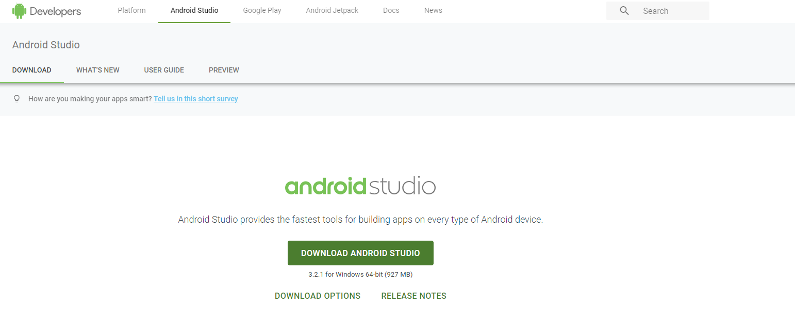
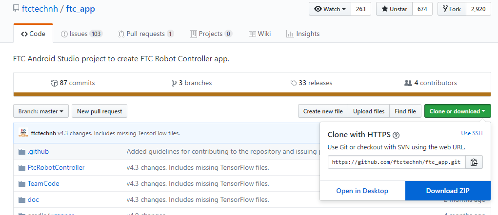
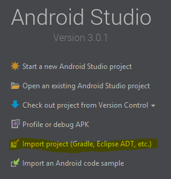
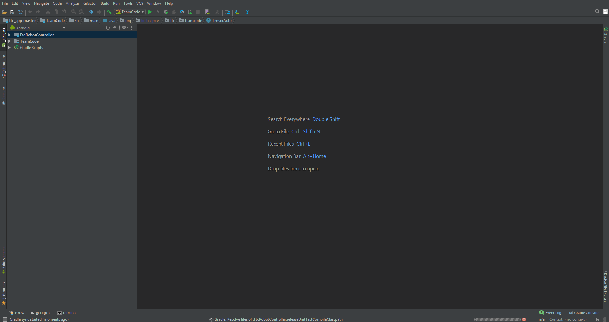
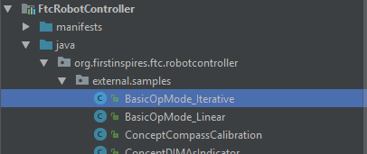
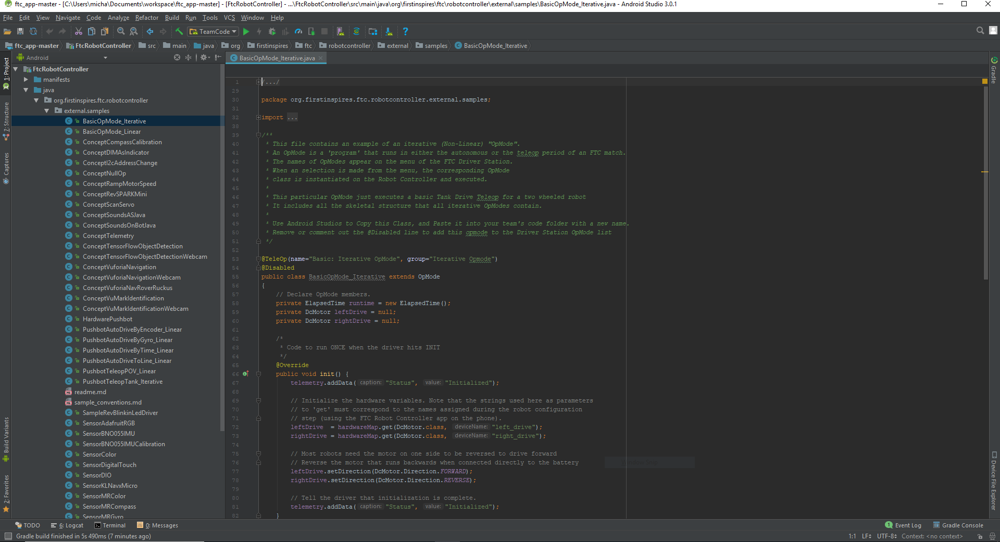
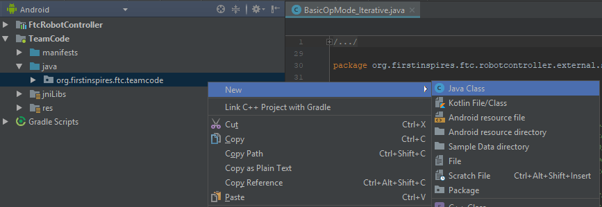

# Coding with Android Studio

## Installation

_\*This can either be really easy or REALLY annoying... Good luck._

1. Start off by going to the [Android Studio Website](https://developer.android.com/studio/) and downloading the installer. Then, follow the instructions to install the program.

   

2. Next, you want to go to the [FTC Github Repository](https://github.com/ftctechnh/ftc_app). Press download ZIP and unzip the file to the place that you want that file to be.

   

3. Open android studio and press import project.

   

4. Find the gradle project labeled ftc\_app-master; click it and press OK to open the project

   

5. Wait while the gradle builds the project. You should see this window:

   

6. After the processes at the bottom of the window finish, head over to the left side and open one of the samples.

   

7. If a lot of the text has red underlines, then close the project and try again. You should see something like this once you open that sample:

   

8. Congratulations! You've just installed the FTC app onto Android Studio. Now go to the teamcode folder and start coding!

   

## Creating OpModes

### Create a New Java File

* Go to the top of the screen and click File &gt; New &gt; Java File
* OR Right Click on the 'teamcode' folder &gt; New &gt; Java File

### Basic Structure

```java
package org.firstinspires.ftc.teamcode;

import com.qualcomm.robotcore.eventloop.opmode.LinearOpMode;
import com.qualcomm.robotcore.eventloop.opmode.TeleOp;
import com.qualcomm.robotcore.hardware.DcMotor;
import com.qualcomm.robotcore.hardware.DcMotorSimple;

@TeleOp(name="TutorialOpMode")
public class TutorialOpMode extends LinearOpMode{
    
    private DcMotor leftWheel;
    private DcMotor rightWheel;
    private double speed = 0.4;
    
    @Override
    public void runOpMode() throws InterruptedException{
    
        leftWheel = hardwareMap.dcMotor.get("leftWheel");
        rightWheel = hardwareMap.dcMotor.get("rightWheel");
        rightWheel.setDirection(DcMotorSimple.Direction.REVERSE);
        
        waitForStart();
        
        while (opModeIsActive()) {
            
            leftWheel.setPower(gamepad1.left_stick_y * speed);
            rightWheel.setPower(gamepad1.right_stick_y * speed);
            
        }
        
    }
    
}

```

Explanations:

```java
package org.firstinspires.ftc.teamcode;

import com.qualcomm.robotcore.eventloop.opmode.LinearOpMode;
import com.qualcomm.robotcore.eventloop.opmode.TeleOp;
import com.qualcomm.robotcore.hardware.DcMotor;
import com.qualcomm.robotcore.hardware.DcMotorSimple;
```

This section of code is in every single Java file that you make. The first line states that this file is in the `teamcode` folder. The next few 'import' lines are automatically added as you type your code and are just the libraries used in the code.

```java
@TeleOp(name="TutorialOpMode")
public class TutorialOpMode extends LinearOpMode{
    ///[...]
}
```

The line with the annotation, `@TeleOp`, tells the FTC app that this file declares a TeleOp rather than an Autonomous. The name is just the display name of the OpMode; by convention, this should be the same as the class name. The next line with `public class TutorialOpMode` says that this file, called TutorialOpMode, is a public [class](https://www.tutorialspoint.com/java/java_object_classes.htm), which is a file format of Java. The next part of this line, `extends LinearOpMode`, states that this class is a [child ](https://www.tutorialspoint.com/java/java_inheritance.htm)of the parent class, and we override the `runOpMode` method.

```java
    private DcMotor leftWheel;
    private DcMotor rightWheel;
    private double speed = 0.4;
```

These lines are the [variable](https://www.javatpoint.com/java-variables) declarations. The first 2 make variables for the 2 wheel motors, and the last one is a constant that represents the speed multiplier.

```java
    @Override
    public void runOpMode() throws InterruptedException{
        //[...]
    }
```

The `@Override` annotation tells the program that it inherits the `runOpMode()` method from the parent class. By saying `public void`, this declares a [method](https://www.tutorialspoint.com/java/java_methods.htm) that doesn't return anything. The `throws InterruptedException` tells the program to ignore the error that the program outputs if you press the stop button.

```java
        leftWheel = hardwareMap.dcMotor.get("leftWheel");
        rightWheel = hardwareMap.dcMotor.get("rightWheel");
        rightWheel.setDirection(DcMotorSimple.Direction.REVERSE);
```

These next 2 lines assign the motor variables values, using the `hardwareMap` class. The string on the right should match the name that you set in the config on the phone. The next line simply reverses the direction of the right wheel, because the motor is opposite of the left one.

```java
        waitForStart();
        
        while (opModeIsActive()) {
                //[...]
        }
```

The `waitForStart()` waits for the start button to be pressed. Everything you want the robot to do after initialization but before starting the program is to be put right before this statement. The while loops runs as long as you don't push the 'stop' button.

```java
            leftWheel.setPower(gamepad1.left_stick_y * speed);
            rightWheel.setPower(gamepad1.right_stick_y * speed);
```

This is the actual code that runs your robot! These 2 lines tell the robot to turn the motors the same power as how far the joystick is pushed forward and multiplied by the speed, which is a percentage. This will control the wheels separately and is the most basic form of control, tank controls.


