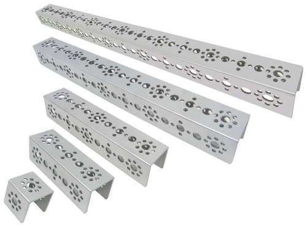
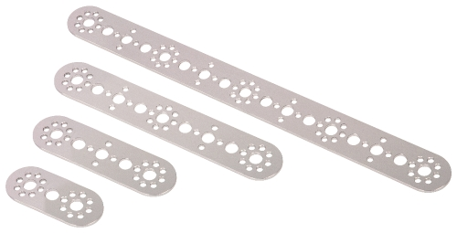
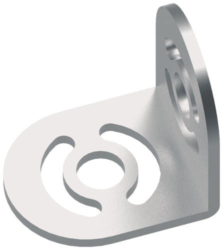

# Parts List

## Tetrix Parts

| Part | Image | Description |
| :--- | :--- | :--- |
| Tetrix MAX Channels |  | These channels are the largest pieces that we have. They are used mostly for the framework of the robot. These pieces are also really good for support and they have a lot of connection points |
| Tetrix MAX Flats |  | The flats are good connector pieces. Although there are many long pieces, we typically don't like using the flats as they tend to bend really easily. |
| Tetrix MAX Adjustable Angle Flat Bracket |  | This piece is really good for putting pieces at an angle, but will need tightening VERY often! |
| Tetrix MAX Adjustable Angle Corner Bracket |  | This piece is like the angled flat bracket, except that it itself is an L; also requires often tightening. |
