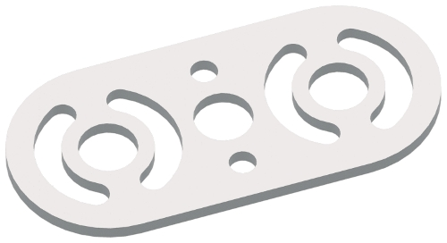

# Parts List

## Tetrix Parts

### Tetrix MAX Channels

These channels are the largest pieces that we have. They are used mostly for the framework of the robot.These pieces are also really good for support and they have a lot of connection points

### Tetrix MAX Flats

The flats are good connector pieces. Although there are many long pieces, we typically don't like using the flats as they tend to bend really easily.

### Tetrix MAX Adjustable Angle Flat Bracket

fffgf\

